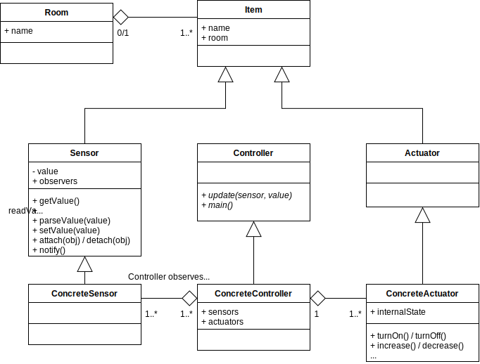

# Smart Home

## Documentation

There are three main classes/objects: sensors, actuators and controllers.
A controller reads data of all sensors it needs and then controls the actuators.

All sensors and actuators have a name and are assigned to a room.
They get instanciated in the main class and stored in a dictionary to access them by their name.

Since controllers are invoked by sensors when their value change (Observer Pattern) everything runs automatically.
Nevertheless it is also possible to explictly run all controllers.

Controllers are packaged by use cases, e.g. there is one package for basic operations (lights, heating, ...), one for kitchen, security (alarms), ...

For testing there is a CLI to manipulate the sensor values and see whether the controllers update the actuators as expected.
The CLI doesn't include functionality to add room, sensors or actuators because it doesn't make sense to change the structure of the smart home during runtime (smart home is static in it's structure of sensors and actuators).

**`Sensor`**:
The `getValue()`-method reads the current value and returns it.
The `readValue()`-method should read the value from the real sensor, so it needs to be implemented specifically for each sensor.
If there are different sensors (e.g. multiple temperature sensors from different vendors and different interfaces) then it would be useful to implement a class for a temperature sensor and additionally for each device model a new class to read the value from this specific device type.
The `readValue()`-method should only read from the sensor.
Steps to convert a value to a standardized format should be implemented in `parseValue()`.
The `setValue()`-method can be used to inject values but **must** be also used in `readValue()` so that other steps connected to setting a value are processed automatically (parsing the value, notifying observers).

**`Controller`**:
The `main()`-method can be invoked regularly so that the controller can check whether actuators should be updated.
This can be useful if there are time-based decisions, but currently it is not really neccessary.
The `update()`-method is invoked everytime a value of an observed value changes.
This includes also the information which sensor invoked the method and what it's current value is.

## Development - ToDo's

**PROBLEM**:
There needs to be a decision how to handle actuators which are normally controlled by sensors but can also be controlled directly/manually (e.g. Voice Assitant, Smartphone App).
Example: Based on the temperature sensor (22 °C) the controller would decide to set heating to level 2.
The heating is set to level 4 by Voice Assistant.
How should the controller handle this situation?

Possible solution:
Actuators have a flag whether they should be controlled automatically (by sensors / controllers) or whether they are set manually.
Actuators can be set back to 'auto' manually or there needs to be a way to automatically switch them back.
That would mean that controllers need to check whether an actuator is set manually and may decide to override it back to 'auto' based on several conditions (time since override, significant environmental/sensor changes, ...).

**QUESTION**:
Should `Controller`'s behave as a `Proxy` for `Actuator`'s so that every `Actuator` has only one `Controller` through which it can be controlled.
This would mean that e.g. `Voice Controller` would need to access `Controller`'s instead of `Actuator`'s directly.

**IDEA**:
Use just one `FireAlertController` (`Singleton`?) which receives the whole `SmartHome` as an argument and can then take values of all `Sensor`'s it needs (`SmokeDetector`, `TemperatureSensor`, ...).
This could make it easier to implement new features for `FireAlertController` in the future.
